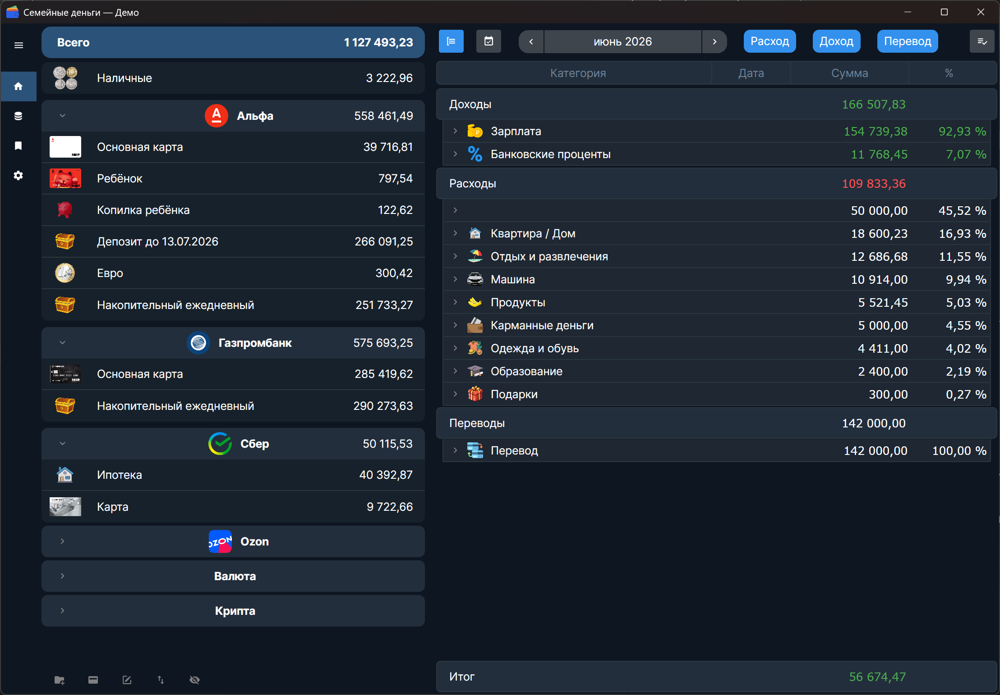
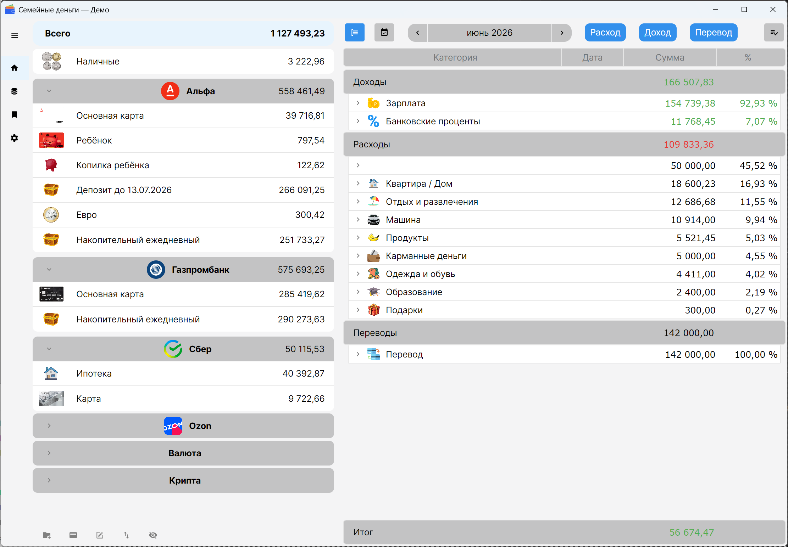

# Семейные деньги

Кроссплатформенное приложение для учёта семейных финансов: счета, транзакции, категории, аналитика по периодам и синхронизация между устройствами.

## О программе

Проект создан как собственная реализация домашнего финансового учёта — с теми возможностями и мелочами, которых не хватало в готовых программах. 

Данные хранятся локально в LiteDB.

## Возможности

- **Счета** — иерархия (группы и вложенные счета), иконки, скрытие счетов, перетаскивание для изменения порядка
- **Транзакции** — расход, доход, перевод; комментарии и теги; список по датам или дерево по категориям
- **Категории** — отдельные списки для доходов, расходов и переводов; подкатегории
- **Периоды** — день, месяц, квартал, год, произвольный интервал, «всё время»
- **Несколько баз данных** — переключение между семейными/личными базами
- **Синхронизация** — через S3-совместимое хранилище; кнопка «Синхронизация» на главном экране
- **Мобильная версия** — Android и компактный desktop-интерфейс навигации с боковым меню и плавающей панелью действий
- **Резервное копирование** — автоматические бэкапы базы по настройке

## Скриншоты

### Desktop — тёмная тема



Слева — счета и навигация, справа — сводка по категориям за выбранный период.

### Desktop — светлая тема



## Горячие клавиши (Desktop)

Классический интерфейс `FamilyMoney.Desktop`. Сочетания работают на главном экране, если фокус не в поле ввода (в текстовых полях действуют стандартные **Ctrl+X** / **Ctrl+C** / **Ctrl+V**).

### Транзакции

| Клавиши | Действие |
|---------|----------|
| **Alt+C** | Новый расход |
| **Alt+D** | Новый доход |
| **Alt+T** | Новый перевод |
| **Esc** | Снять выделение с транзакций |

### Период

| Клавиши | Действие |
|---------|----------|
| **Ctrl+←** | Предыдущий период |
| **Ctrl+→** | Следующий период |
| **Ctrl+P** | Меню выбора периода |
| **Ctrl+1** | День |
| **Ctrl+2** | Месяц |
| **Ctrl+3** | Квартал |
| **Ctrl+4** | Год |
| **Ctrl+5** | Произвольный интервал |

### Счета

| Клавиши | Действие |
|---------|----------|
| **Ctrl+↑** | Предыдущий счёт в списке |
| **Ctrl+↓** | Следующий счёт в списке |

### Окно транзакции

| Клавиши | Действие |
|---------|----------|
| **Ctrl+Alt+←** | Предыдущий день |
| **Ctrl+Alt+→** | Следующий день |
| **Enter** | Добавить тег (в поле ввода тега) |
| **Enter** | Сохранить (**OK**) |
| **Esc** | Отмена |

В остальных диалогах (счёт, категория, база данных, выбор периода) **Enter** подтверждает, **Esc** — отменяет.

## Платформы

| Проект | Назначение |
|--------|------------|
| `FamilyMoney.Desktop` | Классический интерфейс для Windows |
| `FamilyMoney.Navigation.Desktop` | Компактный интерфейс с навигацией (Windows) |
| `FamilyMoney.Android` | Мобильное приложение для Android |

## Технологии

- .NET 10
- [Avalonia UI](https://avaloniaui.net/) 12 + Fluent Theme
- [LiteDB](https://www.litedb.org/)
- [CommunityToolkit.Mvvm](https://github.com/communitytoolkit)
- Синхронизация: S3-совместимое API ([FluentStorage](https://github.com/robinrodricks/FluentStorage))

## Сборка и запуск

Требуется [.NET SDK 10](https://dotnet.microsoft.com/download).

```bash
# Классический desktop (Windows)
dotnet run --project src/FamilyMoney.Desktop/FamilyMoney.Desktop.csproj

# Навигационный desktop
dotnet run --project src/FamilyMoney.Navigation.Desktop/FamilyMoney.Navigation.Desktop.csproj

# Android (нужен Android SDK)
dotnet build src/FamilyMoney.Android/FamilyMoney.Android.csproj
```

Настройки и база данных по умолчанию сохраняются в `%LOCALAPPDATA%\FamilyMoney\`.

## Лицензия

См. репозиторий автора.
